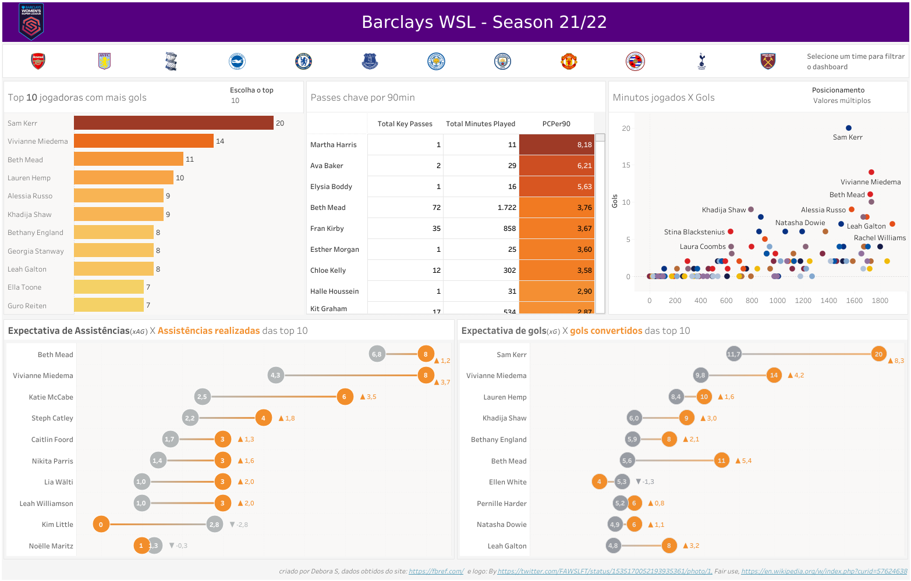

<a href="https://en.wikipedia.org/wiki/File:FA_Women%27s_Super_League.png#/media/File:FA_Women's_Super_League.png">
    
</a>

Barclays Women's Super League - Season 21/22 :soccer:
===

Descrição
---
Depois de passar um bom tempo pensando e enrolando (sim, enrolei demais :stuck_out_tongue_closed_eyes:) em como eu poderia usar minhas ferramentas de trabalho para poder visualizar as informações sobre a liga e as jogadoras da liga feminina de futebol da inglaterra (WSL para os mais chegados :sparkles:), ***FINALMENTE*** eu deixei a procrastinação de lado e coloquei a mão na massa.


Objetivo
---
Meu principal objetivo foi de tentar descobrir quais informações sobre os times, jogadoras e liga eu conseguiria traduzir através dos dados. Claro que tem pouca coisa e sem dúvida eu conseguiria ir mais a fundo mas como um start o resultado foi bom.
Meu segundo objetivo aqui é aprimorar meu conhecimento nas ferramentas que uso no meu dia a dia (Python, SQL, Tableau, Power BI) de forma tranquila, sem pressão e claro usando as bases que eu me sentir confortável em utilizar.
Com o tempo quero poder ter mais dashboards nessa categoria "Esportes" de forma que agregue de alguma forma valor tanto para mim quanto para qualquer um que esteja vendo tanto os códigos quanto os dashboards.

Pré-requisito
---
Pra poder rodar o código em python, é só executar o arquivo `requirements.txt` dentro do ambiente Python que você já deve ter configurado. O comando é:

```sh
pip install -r requirements.txt
```

Para visualizar o Dashboard, basta acessar o link que disponibilizei abaixo. E caso você queira fazer o download do dashboard para poder ver como os cálculos foram criados e o dashboard montado é só entrar em contato comigo que eu libero o download direto lá do Tableau Public. :thumbsup:

Resultado Final
---
Depois de ter finalmente terminado o tratamento dos dados, deixo com vocês um print de como é o Dashboard:



E o link para o dashboard final: [WSL Season 21/22](https://public.tableau.com/views/wsl_21-22/Dashboard1?:language=pt-BR&:display_count=n&:origin=viz_share_link)


Considerações e atribuições
---

Bom, por último e não menos importante quero deixar umas observações aqui.
A análise que eu fiz foi baseada nos dados que obti e questões que eu mesma pensei em responder. Daqui para frente vou fazer outros dashboards e fazer outros tipos de análises também e acredito que com o tempo vou adquirir mais conhecimento tanto nas ferramentas (meu foco maior), quanto no quesito "Dados de futebol".
Outro ponto também que quero deixar bem explicito é que meu foco sempre vai ser analisar dados voltados para o futebol feminino(claro, quando o assunto for futebol rs), já que o que mais conseguimos encontrar na internet e com uma certa facilidade é sobre o futebol masculino. 

Acredito que é isso aí meu povo!
Estou aberta a qualquer tipo de crítica e sugestões sobre essa análise e sobre outras que posso criar no futuro. Se tiverem dicas do que ser respondido e até mesmo de um layout legal de dashboard, só entrarem em contato comigo que vou adorar!

Feedback sempre é bom!!

Abaixo segue links de onde obti os dados e da logo que utilizei no projeto:
Logo Barclays WSL: 
- By https://twitter.com/FAWSLFT/status/1535170052193935361/photo/1, Fair use, https://en.wikipedia.org/w/index.php?curid=57624638

Dados obtidos do site: 
- https://fbref.com/en/
